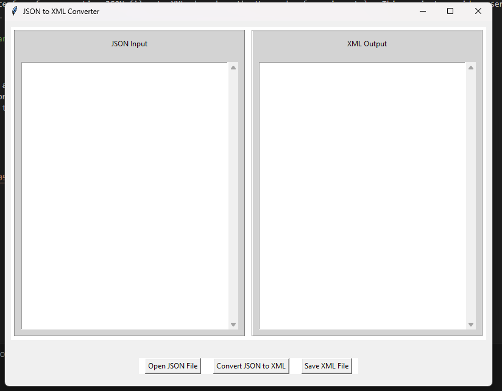

# JSON to XML Converter with GUI

A simple and intuitive graphical user interface for converting JSON files to XML, based on the Harvard referencing style. This project provides users with the ability to visualize both the input JSON and the resulting XML side by side.



## Features

- **Open JSON File**: Allows you to open and preview a JSON file from your file system.
- **Convert JSON to XML**: Converts the provided JSON content to its XML representation.
- **Save XML File**: Export the XML data to a file of your choice.

## Installation

1. Clone this repository:
   \```
   git clone [https://github.com/newan0805/JSON-to-XML-Converter-with-GUI.git]
   \```

2. Navigate to the project directory:
   \```
   cd [YOUR_DIRECTORY_NAME]
   \```

3. Run the application:
   \```
   python main.py
   \```

## How to Use

1. Click on **Open JSON File** to load a JSON file.
2. Review or modify the JSON content if needed.
3. Click on **Convert JSON to XML** to transform the JSON data into XML.
4. Once converted, the XML output will appear on the right pane.
5. Click on **Save XML File** to save the converted XML to your desired location.

## Contributing

Pull requests are welcome. For major changes, please open an issue first to discuss what you would like to change.